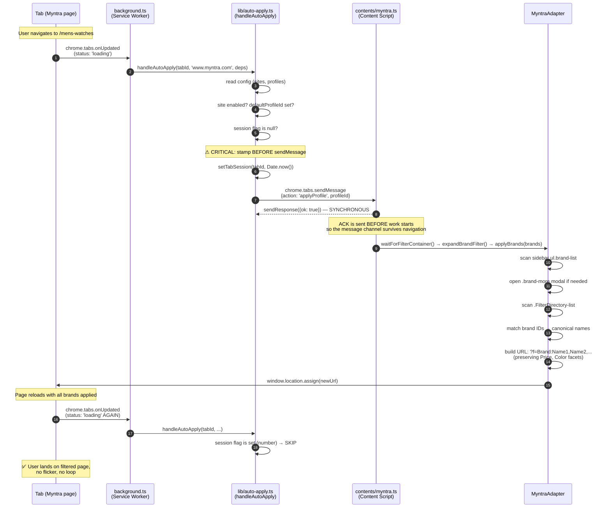
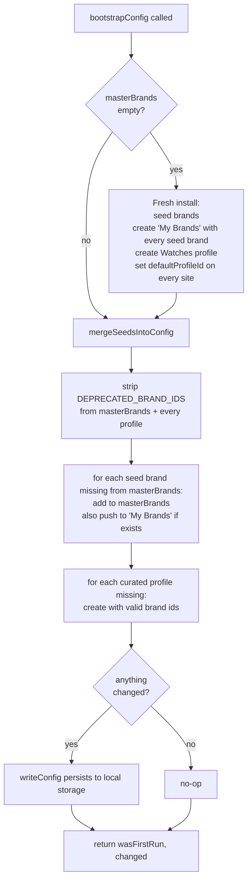
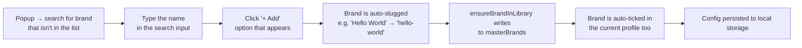
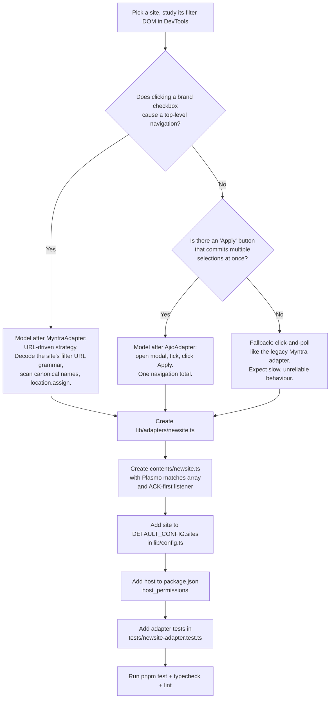

# BrandFilter — Knowledge Transfer (KT) Document

**Audience:** A developer joining the codebase for the first time, or anyone
who needs the complete picture of what the extension does and how it works.

**Last updated:** 2026-05-17

> If you are looking for the rules you must NEVER break while editing the
> codebase, read [`../CLAUDE.md`](../CLAUDE.md) first — it is the canonical
> "do / don't" reference and is shorter. This document is the long-form
> explainer that fills in the _why_ behind those rules.

---

## Table of contents

1. [What this extension is](#1-what-this-extension-is)
2. [Repository tour](#2-repository-tour)
3. [Getting set up](#3-getting-set-up)
4. [End-to-end flow: a brand filter from click to applied](#4-end-to-end-flow-a-brand-filter-from-click-to-applied)
5. [The two adapter strategies](#5-the-two-adapter-strategies)
6. [Storage model and seed migration](#6-storage-model-and-seed-migration)
7. [User workflows (how to do common things in the UI)](#7-user-workflows-how-to-do-common-things-in-the-ui)
8. [Testing approach](#8-testing-approach)
9. [Bug archaeology — the bugs that shaped the current design](#9-bug-archaeology--the-bugs-that-shaped-the-current-design)
10. [Adding support for a new e-commerce site](#10-adding-support-for-a-new-e-commerce-site)
11. [Glossary](#11-glossary)

---

## 1. What this extension is

BrandFilter is a Chrome (Manifest V3) extension that auto-applies a user's
preferred brand filters on e-commerce listing pages. Instead of re-clicking
"Tommy Hilfiger", "H&M", "Levi's" every time you visit
`myntra.com/mens-tshirts`, the extension does it for you on page load.

It supports two built-in sites — **Myntra** and **Ajio** — and a _teach mode_
that lets the user wire up other sites (TataCliq, Flipkart, Amazon.in,
Nykaa Fashion, Snapdeal) by clicking a sample checkbox.

There is **no backend**. All configuration lives in `chrome.storage.local`
(per-browser). There is **no telemetry**. The popup and options UIs are
React + Plasmo.

### The vocabulary you will see everywhere

| Term              | Meaning                                                                                                                                                                                                                                                            |
| ----------------- | ------------------------------------------------------------------------------------------------------------------------------------------------------------------------------------------------------------------------------------------------------------------ |
| **Brand**         | A single brand entry: `{ id: "tommy-hilfiger", name: "Tommy Hilfiger" }`. Optionally has `variants` (alternate spellings — string or regex — used for matching against on-page labels).                                                                            |
| **Master brands** | The authoritative list of all brands the extension knows about. A brand must exist here before any profile can reference it.                                                                                                                                       |
| **Profile**       | A named subset of master brands — e.g. "My Brands" (your defaults), "Watches" (curated watch brands). A brand can belong to multiple profiles.                                                                                                                     |
| **Site**          | A configured e-commerce host (`www.myntra.com`, `www.ajio.com`, taught sites). Each site has an enabled flag and a `defaultProfileId` that auto-applies on load.                                                                                                   |
| **Adapter**       | The site-specific code that knows how to actually apply brands on that site's DOM (`MyntraAdapter`, `AjioAdapter`).                                                                                                                                                |
| **Session flag**  | A per-tab marker (`chrome.storage.session`) saying "this tab has already had auto-apply run on it". Prevents repeated re-application within a tab lifetime. Three states: `null` (fresh), `number` (timestamp = applied), `'user-off'` (user explicitly disabled). |

---

## 2. Repository tour

```
chrome-extension/
├── assets/
│   └── default-brands.json     ← 183 seed brands (men's, women's, watches)
├── background.ts               ← MV3 service worker (thin shell, delegates to lib/)
├── popup.tsx                   ← React popup UI (280×var, dark theme)
├── options.tsx                 ← React options page (4 tabs)
├── contents/
│   ├── myntra.ts               ← Content script for www.myntra.com
│   ├── ajio.ts                 ← Content script for www.ajio.com
│   └── teachable.ts            ← Content script for taught sites (dormant by default)
├── components/                 ← React components used by popup + options
├── lib/                        ← All pure / testable logic
│   ├── config.ts               ← TypeScript interfaces (Brand, Profile, Site, Config, messages)
│   ├── storage.ts              ← chrome.storage helpers (local + session)
│   ├── seed.ts                 ← bootstrapConfig + WATCHES_PROFILE + DEPRECATED_BRAND_IDS
│   ├── auto-apply.ts           ← handleAutoApply + handleReapply + handleTurnOff (orchestration)
│   ├── popup-init.ts           ← initPopupState (popup mount-time work)
│   ├── matching.ts             ← matchesBrand (name + variants → label text)
│   └── adapters/
│       ├── base.ts             ← SiteAdapter interface + waitForElement + pollForElement
│       ├── myntra.ts           ← MyntraAdapter (URL-driven)
│       └── ajio.ts             ← AjioAdapter (modal-batched)
├── tests/                      ← Vitest unit + integration tests
│   ├── setup.ts                ← chrome.* mocks (with REAL quota enforcement)
│   ├── *.test.ts               ← unit tests per module
│   └── integration/            ← cross-module flow tests
├── docs/                       ← This documentation
│   ├── KT.md                   ← You are here
│   ├── PRD.md                  ← Product requirements
│   ├── BRD.md                  ← Business requirements
│   └── workflows/
│       ├── architecture.md
│       └── sequence-diagrams.md
├── CLAUDE.md                   ← Short-form rules / don't-break-these
└── package.json                ← Plasmo, React, Vitest, ESLint, Prettier
```

### Why so much logic lives under `lib/`

Chrome service workers and content scripts have _side effects_ baked into
their lifecycle — they register listeners at module load, they receive
messages, they're destroyed by navigation. That makes them hard to test
directly.

So all decision-making lives as **pure async functions in `lib/`**, each
taking its dependencies as parameters. `background.ts` and `popup.tsx`
are thin shells that wire chrome APIs into those pure functions. This is
what lets the test suite cover every code path without booting a browser.

If you ever feel tempted to put a chrome API call inside an `if` branch,
extract the branch into `lib/` first and inject the chrome call as a dep.

---

## 3. Getting set up

```bash
pnpm install               # install dependencies (pnpm only — not npm/yarn)
pnpm dev                   # start Plasmo hot-reload dev server
# Then in Chrome:
#   1. chrome://extensions
#   2. Enable "Developer mode" (top right)
#   3. "Load unpacked" → select build/chrome-mv3-dev/
#   4. Pin the BrandFilter icon to the toolbar

pnpm build                 # production build → build/chrome-mv3-prod/
pnpm package               # zip the prod build for Chrome Web Store upload

pnpm test                  # vitest run (one shot; CI uses this)
pnpm test:watch            # vitest in watch mode (for TDD)
pnpm typecheck             # tsc --noEmit (strict)
pnpm lint                  # eslint + prettier --check
```

**First time installing locally:** the extension will open the options page
automatically. It seeds 183 master brands, creates the "My Brands" profile
containing all of them, creates the "Watches" curated profile, and sets
"My Brands" as the default for Myntra + Ajio. Visit `myntra.com/mens-tshirts`
to see auto-apply work.

**During iteration:** when you save a file, `pnpm dev` rebuilds and Plasmo
tries to reload the extension. If reload doesn't take effect, click the
↻ button next to BrandFilter on `chrome://extensions`. The extension's
service worker bootstrap runs on every wake — see §6 — so a reload always
gives you a fresh, fully-seeded state without losing your saved profiles.

---

## 4. End-to-end flow: a brand filter from click to applied

This is the canonical journey for "user navigates to Myntra → filter
applies". Every architectural decision in the codebase exists to make this
flow reliable.



Two non-obvious rules keep this flow correct. Both have entire test files
guarding them (`tests/auto-apply.test.ts`, `tests/myntra-adapter.test.ts`):

### Rule 1: stamp the session flag BEFORE `sendMessage`, not after

If you stamp the flag after the message round-trip, the adapter's
navigation (step 11) will trigger another `onUpdated`, the second
`handleAutoApply` will see `session === null`, and it will fire another
`applyProfile`. The original content script is destroyed by the navigation
so its `sendResponse` never arrives → `sendMessage` rejects → the catch
path could clear the flag → loop forever.

### Rule 2: content scripts ACK the message synchronously

`chrome.tabs.sendMessage`'s promise resolves only when the content script
calls `sendResponse`. If the content script waited until after the adapter
finished, it would never get to call `sendResponse` — the page would
navigate first and tear down the script. Acknowledging first decouples the
message round-trip's success from the adapter's success.

```ts
// contents/myntra.ts — simplified
chrome.runtime.onMessage.addListener((msg, _sender, sendResponse) => {
  if (msg.action === 'applyProfile') {
    sendResponse({ ok: true }) // ← ACK FIRST
    void handleApply(msg) // ← then do the work async
    return false
  }
})
```

---

## 5. The two adapter strategies

Each site implements `SiteAdapter` (in `lib/adapters/base.ts`):

```ts
interface SiteAdapter {
  hostname: string
  isFilterPage(): boolean // pre-flight: is this a listing page?
  expandBrandFilter(): Promise<void> // open the brands accordion if collapsed
  waitForFilterContainer(timeoutMs?): Promise<void> // wait for the filter pane DOM
  applyBrands(brands: Brand[]): Promise<ApplyResult> // apply + return what landed
  clearAppliedBrands(): Promise<void> // undo our applied brands
}
```

But the **strategy** for `applyBrands` differs radically between the two
adapters, because Myntra and Ajio behave differently when checkboxes click.

### MyntraAdapter — URL-driven

Myntra's brand filter clicks **navigate the page**. Click "Timex" →
URL changes to `?f=Brand:Timex` → full page load. Click another brand →
URL changes again → another load. The content script is killed by each
navigation.

So clicking checkboxes one at a time is the wrong strategy: the script
only manages 1–2 clicks before dying. The adapter instead:

1. **Reads** the canonical brand names from `ul.brand-list` (visible
   sidebar, ~8 brands).
2. If any requested brand isn't in the sidebar, **opens** the
   "+ N more" modal (`.FilterDirectory-list`) once — this is a JS-only
   UI toggle, no navigation — and reads from there too.
3. **Matches** each profile brand against the discovered canonical names.
4. **Builds** a target URL:
   `?f=Brand:Name1,Name2,...::Price:500-1000::Color:Black`
   (preserving every non-Brand facet the user already had).
5. **Navigates** once with `window.location.assign(newUrl)`.

The result: applying a 21-brand profile takes one navigation, lands every
brand in the URL, and the post-navigation `onUpdated` is correctly
blocked by the session flag.

The URL grammar is encoded as `static readonly` selectors on the adapter:

```ts
static readonly URL_FACET_PARAM        = 'f'         // ?f=...
static readonly URL_FACET_SEPARATOR    = '::'        // Brand:X::Price:500-1000
static readonly URL_BRAND_FACET_PREFIX = 'Brand:'    //
static readonly URL_BRAND_VALUE_SEPARATOR = ','      // Brand:X,Y,Z
```

`parseBrandsFromUrl(href)` and `buildUrlWithBrands(href, names)` are
exposed as public methods (despite living on a class) so the unit tests
can exercise them as pure functions.

### AjioAdapter — modal-batched

Ajio's modal works differently — clicking checkboxes inside the
`.more-popup-container` modal does NOT navigate. Only clicking the
modal's "Apply" button commits the selection in a single navigation.

So the adapter:

1. **Finds the brands facet** — Ajio renders one `.cat-facets` per filter
   group (Shop For, Category, Brands, Price, ...). The brands one is
   identified by `aria-label="brands"` on its header toggle. Every DOM
   query is scoped to that facet's host (see `findBrandsFacetHost()` in
   `lib/adapters/ajio.ts`). **A bare `.cat-facets X` selector returns
   the first match in document order — which on the clothing page is
   Category, not Brands. This was a real bug — see §9.**
2. **Expands** the accordion if `aria-expanded="false"`.
3. **Opens the MORE modal** (scoped via the brands host's `.facet-more`).
4. **Sanity-checks** that the opened modal actually contains
   `input[name="brand"]` — if not, dismiss it (we opened the wrong
   facet's modal) and fall back to inline.
5. **Ticks** every matching brand checkbox.
6. **Clicks "Apply"** once → single navigation.

### Why not URL-drive Ajio too?

Ajio's URL grammar is less clean (it varies by listing endpoint), and the
modal approach already commits in one navigation. The added complexity
of replicating two grammars isn't justified yet.

---

## 6. Storage model and seed migration

### What's stored where

```
chrome.storage.local  ← key: 'brandfilter_config'
                        value: Config (see lib/config.ts)
                        - version: '1'
                        - masterBrands: Brand[]   (183 seeded)
                        - profiles: Profile[]     (My Brands + Watches + user-added)
                        - sites: Site[]           (Myntra + Ajio + taught)

chrome.storage.session ← key: 'applied_{tabId}'
                         value: number (timestamp) | 'user-off' | (absent)
                         Cleared when browser closes.
```

### Why `chrome.storage.local` and not `chrome.storage.sync`?

`chrome.storage.sync` has an **8 KB per-item quota**. Our seeded config
(183 brands + the My Brands profile listing every brand id) is ~10.5 KB.
Cross-device sync was originally a requirement, but the quota made it
impossible without aggressive chunking. We switched to `chrome.storage.local`
(5 MB limit) and accepted the trade-off.

`tests/storage-quota.test.ts` is a tripwire — it builds a realistic config
and asserts it (a) fits comfortably in local and (b) would exceed sync.
If anyone tries to switch back to sync, that test fails loudly.

There is a **one-time sync → local migration** in `lib/storage.ts`'s
`getConfig()`: first call after upgrade reads from sync, copies to local,
and returns. Subsequent reads use local only.

### The seed migration (`lib/seed.ts`)

`bootstrapConfig(seedBrands, seedProfiles, readConfig, writeConfig)` runs
on every service-worker wake. It is idempotent.



This is called from **three** places:

1. **Top level of `background.ts`** — runs on every SW wake, including
   `chrome://extensions → Reload`. Without this, dev iteration left
   fresh installs with `profiles: []`.
2. **`chrome.runtime.onInstalled`** — true install/update. Opens options
   page when `reason === 'install'`.
3. **`chrome.runtime.onStartup`** — browser launch.

Plus a **self-heal call in `popup.tsx`** (via `initPopupState`) so that
a popup opened during the race window between SW wake and bootstrap
completion still sees seeded data.

### Adding or retiring seed brands

To add new default brands shipping in the extension:

1. Append to `assets/default-brands.json`.
2. Existing installs pick them up on next SW wake — they appear in
   `masterBrands` **and** in the existing "My Brands" profile.
3. Curated profiles (Watches) are **not** modified — only the default
   profile receives propagation.

To retire a brand:

1. Add its id to `DEPRECATED_BRAND_IDS` in `lib/seed.ts`.
   Removing it from the JSON alone is not enough — existing installs
   have the entry persisted in storage.
2. On next SW wake the brand is stripped from `masterBrands` and every
   profile's `brandIds`.
3. Even if a stale JSON re-introduces the id, the deprecation list
   blocks it from being re-added.

---

## 7. User workflows (how to do common things in the UI)

This section is the "user manual" — what someone clicking buttons in the
extension actually does.

### 7.1 Adding a new brand to the master library



Slug rules (`popup.tsx` → `handleAddBrand`):

- Lowercase
- Spaces and special chars → hyphens
- Strip leading/trailing hyphens
- Empty result after slugging → silently rejected (prevents broken IDs
  like `''` from `'???'`)
- Duplicate id → not re-added; existing entry wins

### 7.2 Adding brands from the Options page

Master Brands tab → table of every brand → "Add brand" button at top.
Same slugging + dedupe as the popup path. The "Used in profiles" column
shows where each brand is referenced.

### 7.3 Creating a new profile

Options → Profiles tab → "New profile" button.

| Field            | Purpose                                                                                 |
| ---------------- | --------------------------------------------------------------------------------------- |
| Name             | Display name (e.g. "Office wear")                                                       |
| Icon             | Single emoji shown in popup dropdown                                                    |
| Brands           | Multi-select against masterBrands                                                       |
| Default for site | Optional — set this profile as `defaultProfileId` on a site (auto-applies on page load) |

Profile ids are slugged from the name (same rules as brands). Duplicate
profile ids are rejected.

### 7.4 Editing a profile from the popup

1. Open popup
2. Select the profile in the dropdown
3. The brand multi-select below shows that profile's brands
4. Tick / untick brands
5. **Auto-saves** — no save button. Reflected in storage immediately.
6. Click ▶ Apply to push the updated profile to the current tab.

### 7.5 Removing a brand

From the popup: untick it in the multi-select for the current profile.
This removes it from THAT profile only — the master entry stays.

From the Options page: Master Brands tab → row → delete icon. This
removes it from `masterBrands` AND from every profile's `brandIds`.

### 7.6 Retiring a seeded brand from every install (shipping decision)

This is a developer action, not a user one — but it's worth knowing.

1. Add the brand id to `DEPRECATED_BRAND_IDS` in `lib/seed.ts`
2. Optionally also remove it from `assets/default-brands.json`
3. Ship the update. On the next SW wake on each install, the migration
   strips the brand from `masterBrands` and every profile.
4. Test `tests/seed.test.ts` → "DEPRECATED_BRAND_IDS includes the
   user-retired brands" pins which ids are deprecated.

### 7.7 Setting a site's default profile

Options → Sites tab → row for `www.myntra.com` (or Ajio, or a taught
site) → "Default profile" dropdown. Whatever you pick is what auto-applies
when the user lands on that site's listing page.

### 7.8 The "Off" button

Popup → ✕ Off. Sets the session flag to `'user-off'` and tells the
content script to clear our applied brands. Auto-apply is blocked for
this tab for the rest of the browser session. Closing the tab (or browser)
resets it.

### 7.9 Teach mode (taught sites)

For sites the extension doesn't natively support:

1. Visit the unsupported site (must be one of the allowlisted hosts:
   TataCliq / Flipkart / Amazon.in / Nykaa Fashion / Snapdeal)
2. Open popup → "Teach this site" button
3. Cursor changes to crosshair; a blue overlay appears
4. Click any brand checkbox on the page
5. The extension walks up 5 ancestors and infers a CSS selector
6. Confirmation toast shows the inferred selector — confirm or retry
7. On confirm, the site is added to `config.sites` with that
   `customSelector`. Auto-apply uses a generic selector-driven adapter.

Security note (do not loosen): the toast uses `element.textContent`,
never `innerHTML`, to display the inferred selector. The selector is
ultimately page-provided and must not be parsed as HTML.

### 7.10 Export / Import config

Options → Export/Import tab → "Download config" produces a JSON file
of your full `Config` (brands, profiles, sites). Import accepts the
same shape. Import validates strictly:

- All profile `brandIds` must resolve in `masterBrands`
- Brand ids must match slug rules
- Duplicate ids are rejected (no silent merge)
- Schema version must be `'1'`

A failed import shows an error and does not touch existing config.

---

## 8. Testing approach

```bash
pnpm test          # one-shot vitest run — 169 tests in ~5 s
pnpm test:watch    # watch mode for TDD
```

### What's tested where

| Layer                   | File                                   | What it tests                                                                                                                        |
| ----------------------- | -------------------------------------- | ------------------------------------------------------------------------------------------------------------------------------------ |
| Storage                 | `tests/storage.test.ts`                | `getConfig` / `setConfig` against `chrome.storage.local`. Sync→local migration. `ensureBrandInLibrary`. Session helpers.             |
| Storage tripwire        | `tests/storage-quota.test.ts`          | Realistic config fits in local with massive headroom; would exceed sync per-item quota; mocked sync.set actually enforces the quota. |
| Seed                    | `tests/seed.test.ts`                   | Brand merge, profile creation, deprecation removal, default-profile propagation, fresh-install seeding, idempotency.                 |
| Bootstrap orchestration | `tests/auto-apply.test.ts`             | The session-flag ordering rule (stamp before sendMessage) under the realistic "navigation fires mid-sendMessage" race.               |
| Popup init              | `tests/popup-init.test.ts`             | `initPopupState` never throws; bootstrap-write failure is non-fatal; failure mapped to `{ok:false, error}`.                          |
| Myntra adapter          | `tests/myntra-adapter.test.ts`         | URL grammar (parse/build), DOM scan, single-navigation guarantee, facet preservation, 21-brand regression.                           |
| Ajio adapter            | `tests/ajio-adapter.test.ts`           | Multi-facet page fixtures, scoping to the brands facet, modal Apply behaviour, dismissal of wrong-modal opens.                       |
| End-to-end              | `tests/integration/apply-flow.test.ts` | `handleAutoApply → content-script ACK → MyntraAdapter`. Single navigation contains all brands; second onUpdated is session-blocked.  |

### The test harness (`tests/setup.ts`)

The chrome.\* mocks aren't dumb `vi.fn()`s — they enforce **real chrome
quotas**:

```ts
const SYNC_QUOTA_BYTES_PER_ITEM = 8192      // chrome.storage.sync limit
const LOCAL_QUOTA_BYTES         = 5 * 1024 * 1024  // chrome.storage.local

function makeBackend(store, quota) {
  return {
    set: vi.fn(async (obj) => {
      // throws "QUOTA_BYTES_PER_ITEM quota exceeded" if exceeded
      Object.assign(store, obj)
    }),
    ...
  }
}
```

This is intentional — a previous incarnation of these mocks always
succeeded, which let the original "popup stuck on Loading…" bug sneak
into production. Now the test suite catches quota breaches before they
reach a real browser.

### How to write a regression test that won't drift

Whenever you fix a real-world bug, name the test after the bug and put
the symptom in the test description, not just the assertion:

```ts
it('a second onUpdated fired DURING an in-flight applyProfile is blocked by the session flag', ...)
it('clicks the BRANDS facet MORE, NOT the Category facet MORE', ...)
it('applies all 21 watch-profile brands in a single navigation (regression: only-2-brands bug)', ...)
```

That way the next person seeing the test failure can read the title and
immediately understand what user-visible behaviour they just regressed.

---

## 9. Bug archaeology — the bugs that shaped the current design

Read this section when something seems over-engineered or oddly defensive.
Almost every "why?" in the codebase has a story.

### Bug 1: "No profiles yet" forever after extension reload

**Symptom:** Fresh dev install → popup shows "No profiles yet" → never
self-heals.

**Root cause:** The seed migration originally ran only inside
`chrome.runtime.onInstalled` and `onStartup` listeners. Neither fires
on `chrome://extensions → Reload` (the dev iteration path). The service
worker just restarts. So storage stayed empty.

**Fix:** `bootstrapConfig()` is called at the **top level** of
`background.ts` — every SW wake runs it. Plus the popup also calls
`bootstrapConfig` on mount as a self-heal for the race window.

**Test:** `tests/seed.test.ts` → "SW-init scenario (fresh install, no
chrome event)" suite.

### Bug 2: Popup stuck on "Loading…"

**Symptom:** Popup opens, shows "Loading…", never advances.

**Root cause:** `chrome.storage.sync.set` threw `QuotaExceededError`
(>8 KB) once the seed grew past ~90 brands. The popup's mount-time
IIFE was fire-and-forget with no `try/catch`, so the rejection was
swallowed → React state stayed at `config = null` → forever-Loading.

**Fix:**

- Switch to `chrome.storage.local` (5 MB).
- Extract popup init into `lib/popup-init.ts` → `initPopupState`,
  which returns `{ok: false, error}` instead of throwing. Popup
  surfaces a visible error state if it fails.

**Test:** `tests/popup-init.test.ts` + `tests/storage-quota.test.ts`.

### Bug 3: Myntra apply-loop / URL flicker

**Symptom:** Applying a watches profile on Myntra → URL flickers between
brand combinations → page never settles.

**Root cause:** Two compounding issues.

- **Adapter strategy:** Per-checkbox clicking on Myntra causes a navigation
  per click. Only 1–2 clicks land before the content script is destroyed.
- **Background:** Session flag was stamped AFTER awaiting `sendMessage`.
  Each per-click navigation fired `onUpdated`, saw `session === null`,
  re-fired `applyProfile`, fresh content script clicked the next brand,
  ... infinite loop.

**Fix:**

- `MyntraAdapter` switched to **URL-driven**: scan, build URL, ONE
  `location.assign`. See §5.
- `lib/auto-apply.ts` stamps the session flag **BEFORE** `sendMessage`.
- Content scripts ACK the message synchronously before doing work, so
  `sendMessage` resolves in <1 ms even when the adapter later navigates.

**Tests:** `tests/auto-apply.test.ts`, `tests/myntra-adapter.test.ts`,
`tests/integration/apply-flow.test.ts`.

### Bug 4: Ajio opens "Choose Category" modal instead of brands

**Symptom:** On `ajio.com/s/clothing-...`, clicking Apply popped open
the Category picker, not the brands picker. Watches profile worked on
the watches page but not on clothing.

**Root cause:** Selector `.cat-facets .facet-more` is a document-wide
match. The clothing page has multiple `.cat-facets` (Shop For, Category,
Brands, Price, ...). `querySelector` returned the FIRST match — Category.
The watches page accidentally had Brands as the first facet, hence the
selective failure.

**Fix:** `AjioAdapter.findBrandsFacetHost()` looks up the
`.cat-facets` whose header has `aria-label="brands"`. Every subsequent
query is scoped to that host. A safety check also dismisses any modal
that turns out to contain no `input[name="brand"]`.

**Test:** `tests/ajio-adapter.test.ts` → "clicks the BRANDS facet MORE,
NOT the Category facet MORE".

### Bug 5: Only 2 watch brands applied on Myntra

**Symptom:** Watches profile (21 brands) applied → URL ends up with
just `?f=Brand:Invicta,Sonata`.

**Root cause:** Same as Bug 3 — per-click navigation killed the content
script after 1–2 clicks. The session-flag fix made the symptom less
violent (no infinite loop), but the strategy was still wrong.

**Fix:** Same as Bug 3 — URL-driven Myntra adapter applies all 21
brands in one navigation.

---

## 10. Adding support for a new e-commerce site



### Concrete checklist

1. **`lib/adapters/newsite.ts`** — implement `SiteAdapter`. Borrow heavily
   from Myntra (URL-driven) or Ajio (modal-batched).
2. **`contents/newsite.ts`** — Plasmo content script. Must:
   - `export const config: PlasmoCSConfig = { matches: ['https://www.newsite.com/*'], run_at: 'document_idle' }`
   - Acknowledge `applyProfile` synchronously, run `handleApply` async.
3. **`lib/config.ts`** — add the new site to `DEFAULT_CONFIG.sites`:
   ```ts
   { id: 'newsite', hostname: 'www.newsite.com', defaultProfileId: '', enabled: true, customSelector: null }
   ```
   `defaultProfileId: ''` so first-run seeding fills it with `'my-brands'`.
4. **`package.json`** — add `"https://*.newsite.com/*"` to
   `manifest.host_permissions`.
5. **`tests/newsite-adapter.test.ts`** — minimum coverage:
   - `isFilterPage()` (true / false / edge cases)
   - `applyBrands()` happy path
   - Skip-if-checked
   - Brand not found
   - `clearAppliedBrands()`
   - **If multi-facet:** a fixture with sibling facets to prove your
     selectors are properly scoped (Ajio learned this the hard way).
6. **CLAUDE.md** — if there are any "don't break this" rules specific to
   the site (URL grammar, accordion wait timings, scoping), add them to
   the Core Rules table.

---

## 11. Glossary

| Term                                                | Definition                                                                                                                                                                                                 |
| --------------------------------------------------- | ---------------------------------------------------------------------------------------------------------------------------------------------------------------------------------------------------------- |
| **ACK-first**                                       | Pattern where `chrome.runtime.onMessage` listener calls `sendResponse({ok:true})` synchronously, then runs the async work. Prevents the message channel from dying when the work later navigates the page. |
| **Adapter**                                         | The site-specific code that knows the DOM and URL grammar for one e-commerce host. Implements `SiteAdapter`.                                                                                               |
| **Apply-loop**                                      | The bug where Myntra's per-click navigation causes `handleAutoApply` to re-fire endlessly. Prevented by the session-flag-before-sendMessage rule.                                                          |
| **Brand**                                           | `{id, name, variants?}`. Matched against on-page label text by `matchesBrand`.                                                                                                                             |
| **Bootstrap**                                       | `bootstrapConfig()` — idempotent migration that seeds fresh installs and tops up existing ones on every SW wake.                                                                                           |
| **Canonical name**                                  | A brand's name _as Myntra/Ajio writes it_ in their DOM (`input.value`). May differ from our `brand.name`. We always use the canonical name in URLs/clicks.                                                 |
| **Deprecation**                                     | Adding a brand id to `DEPRECATED_BRAND_IDS` so the next migration strips it from every install's storage.                                                                                                  |
| **Facet**                                           | A category of filters on Ajio (Shop For, Category, Brands, Price, ...). Each renders as one `.cat-facets` element.                                                                                         |
| **handleAutoApply / handleReapply / handleTurnOff** | The three pure orchestration functions in `lib/auto-apply.ts` that `background.ts` delegates to.                                                                                                           |
| **My Brands**                                       | The default seed profile (id: `'my-brands'`). Contains every seed brand on a fresh install. Receives propagation when new seed brands are added on existing installs.                                      |
| **NotFound**                                        | A brand id reported back in `ApplyResult.notFound` when no checkbox on the page matches it. Treated as silent — not an error.                                                                              |
| **Profile**                                         | A named subset of master brands. `Profile.brandIds: string[]`.                                                                                                                                             |
| **Session flag**                                    | `chrome.storage.session['applied_{tabId}']`. Three states: `null` (fresh), `number` (timestamp = applied), `'user-off'` (explicitly disabled). Per-tab, cleared on browser close.                          |
| **Teach mode**                                      | The UX where a user clicks a brand element on an unsupported site and the extension infers a CSS selector. Stored as `Site.customSelector`.                                                                |
| **URL-driven strategy**                             | Adapter approach where `applyBrands` ends in `window.location.assign(url)` rather than per-checkbox clicks. Used by Myntra.                                                                                |
| **Variants**                                        | `Brand.variants?: BrandVariant[]` — alternate spellings (string contains, or regex match) used by `matchesBrand`. E.g. `{type:'string', value:'H & M'}` matches H&M label text with spaces.                |

---

## Where to go next

- **CLAUDE.md** — the don't-break-this rules (10 of them)
- **docs/PRD.md** — what the extension is supposed to do
- **docs/BRD.md** — the business framing
- **docs/workflows/architecture.md** — diagrams of components + data flow
- **docs/workflows/sequence-diagrams.md** — message flows for each user action
- **lib/seed.ts** — start here if you want to understand storage / data
- **lib/auto-apply.ts** — start here if you want to understand orchestration
- **lib/adapters/myntra.ts** — start here if you want to understand a real adapter

Welcome aboard.
