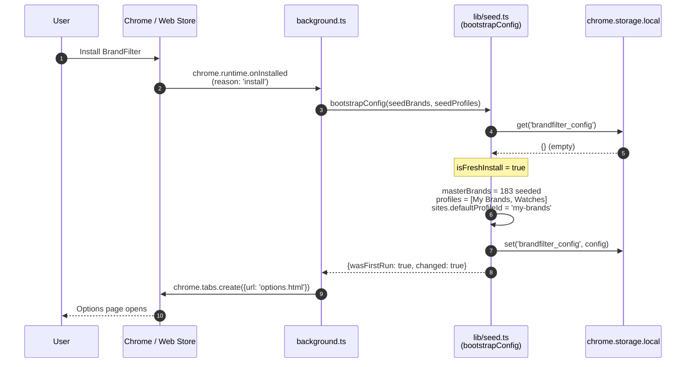
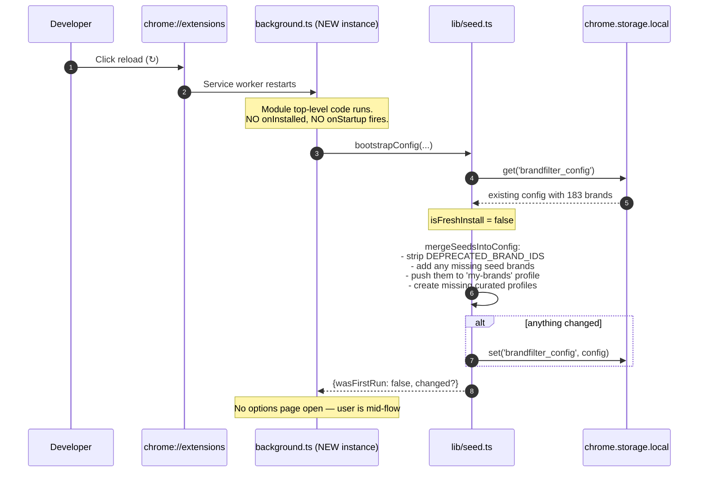
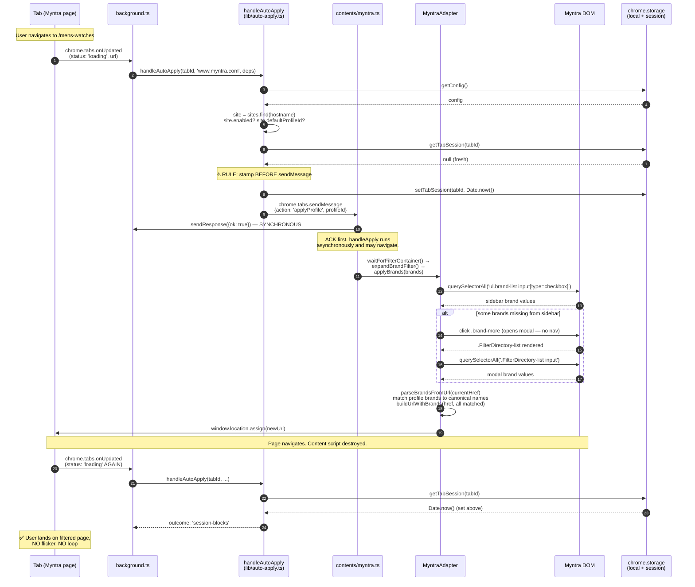
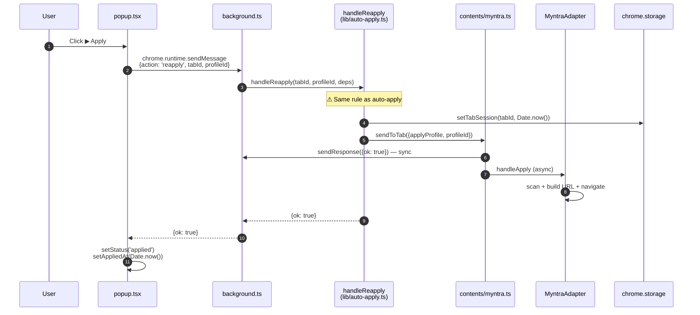
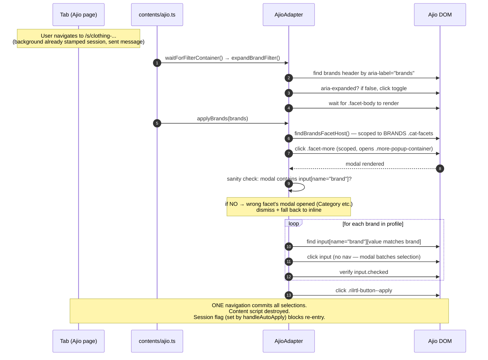
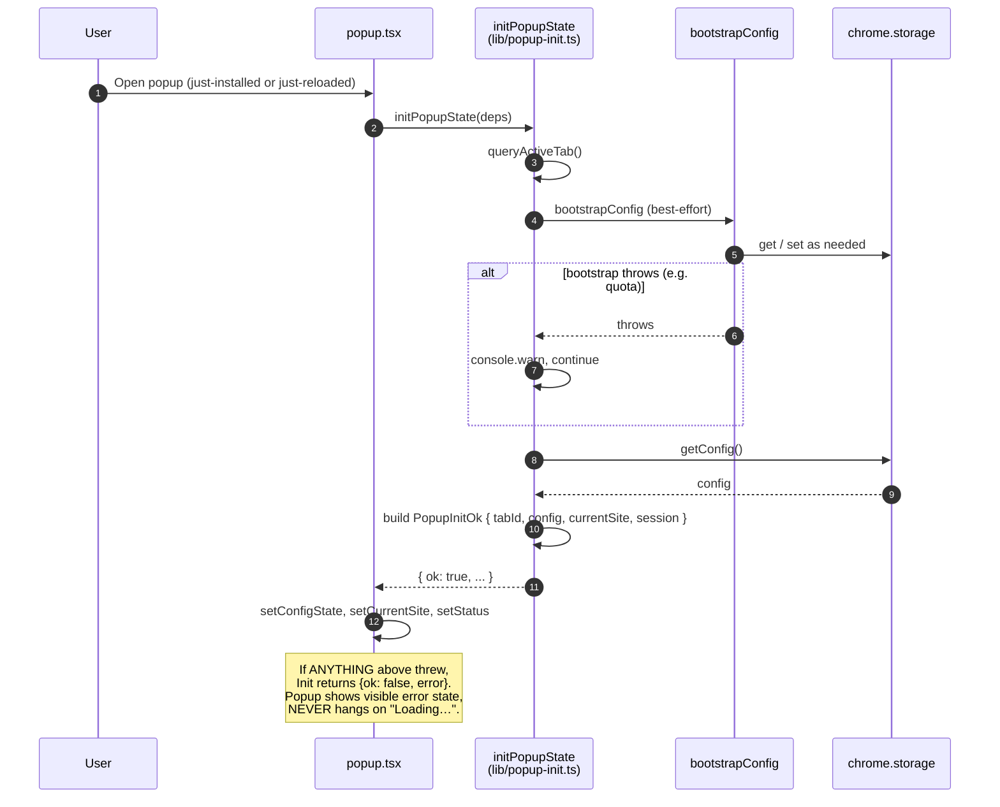
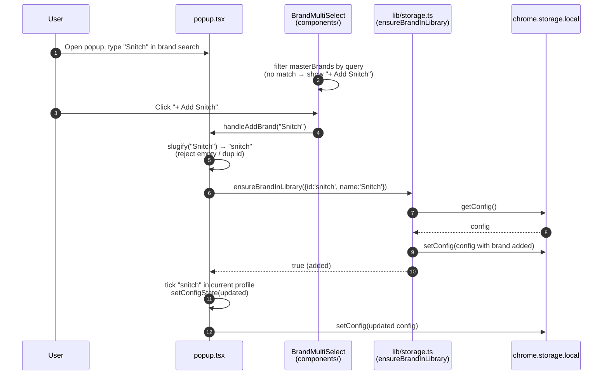
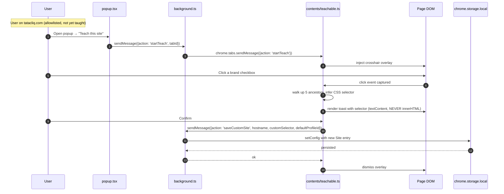
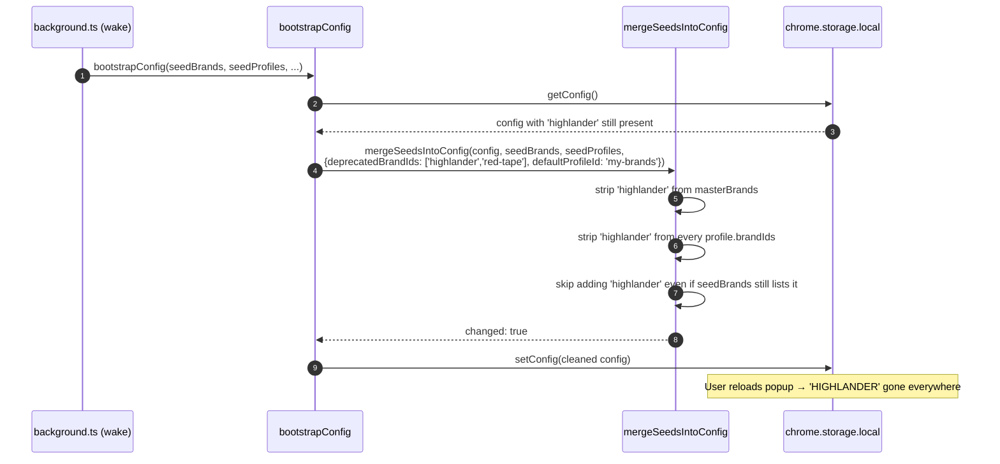

# BrandFilter — Sequence Diagrams

**Last updated:** 2026-05-17

All diagrams are Mermaid. They render natively on GitHub, VS Code, and
most Markdown viewers.

---

## 1. First-run install (fresh storage)



---

## 2. SW wake on `chrome://extensions → Reload` (existing install)

The canonical bug this guards against: the user reloads the extension
during dev and ends up with `profiles: []`. Fixed by calling
`bootstrapConfig` at the top level of `background.ts`.



---

## 3. Auto-apply on Myntra navigation (the canonical flow)



---

## 4. Manual Re-apply from popup



If `sendToTab` rejects (e.g. content script crashed), the catch path
calls `clearTabSession` so the user can retry. The user-off sentinel
is honoured separately by `handleTurnOff` and NEVER auto-cleared.

---

## 5. Auto-apply on Ajio (modal-batched)



---

## 6. User clicks ✕ Off

```mermaid
sequenceDiagram
    autonumber
    participant U as User
    participant P as popup.tsx
    participant SW as background.ts
    participant Off as handleTurnOff<br/>(lib/auto-apply.ts)
    participant CS as Content script
    participant A as Adapter
    participant Store as chrome.storage

    U->>P: Click ✕ Off
    P->>SW: chrome.runtime.sendMessage<br/>{action: 'turnOff', tabId}
    SW->>Off: handleTurnOff(tabId, deps)
    Note over Off: ⚠ user-off persists even on send failure
    Off->>Store: setTabSession(tabId, 'user-off')
    Off->>CS: sendToTab({action: 'clearFilters'})
    CS->>SW: sendResponse({ok: true}) — sync
    CS->>A: clearAppliedBrands()
    alt MyntraAdapter
        A->>A: buildUrlWithBrands(href, []) — strip Brand facet
        A->>CS: window.location.assign(newUrl)
    else AjioAdapter
        A->>A: untick tracked brands inline, or<br/>open modal + untick + Apply
    end
    Off-->>SW: {ok: true}
    SW-->>P: {ok: true}
    P->>P: setStatus('off')
```

Subsequent navigations on this tab see `session === 'user-off'` →
`handleAutoApply` returns `outcome: 'session-blocks'` → auto-apply
never re-fires until the tab/browser closes.

---

## 7. Popup self-heal bootstrap (race-window guard)



---

## 8. Adding a brand via the popup search



---

## 9. Teach mode: teaching a new site



---

## 10. Deprecated brand removal (on next SW wake)



Idempotency: a second pass with no new deprecations would return
`changed: false` and write nothing.

---

## Reading guide

Each diagram is meant to be sufficient on its own — read top-to-bottom,
follow the autonumbers, treat side comments (the `Note over X` blocks)
as the architectural rules being enforced.

If you find a divergence between any diagram and the actual code, the
**code is canonical** — open an issue and update this doc. Don't change
code to match an outdated diagram.
